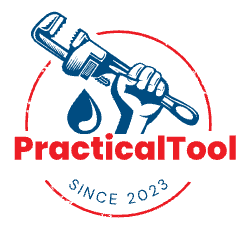

  

<h1 align="center">Practical Tool - 实用工具集</h1>

  
  
  

  <i>解决问题，轻松前行。</i>

## 🛠️ 功能和内容

欢迎来到实用工具集，这里是一个聚合了日常使用的实用工具和代码库的社区。我们的目标是帮助你更轻松地解决各种问题，提供工具和代码库，从而节省你宝贵的时间和精力。

### 主要特性

- **ChatGPT生成的脚本**：自动化任务、文本生成和更多。
- **命令行工具**：日常任务、文件处理、数据分析等。
- **实用函数库**：通用函数，减少代码冗余。

## 🚀 使用方法

你可以在项目中浏览和选择你感兴趣的工具和代码库。每个工具和库都有详细的使用说明和示例，以便你快速上手。无需复杂的安装或配置，开始提高你的工作效率吧！

## 👥 贡献

我们热烈欢迎你的贡献！无论是新工具、改进、修复漏洞还是文档，你的帮助将使这个工具集更加强大和有用。请查看 [贡献指南](CONTRIBUTING.md) 以获取更多信息。

## 📄 许可证

这个项目采用 [MIT 许可证](LICENSE)。这意味着你可以自由使用、修改和分享工具和代码，只需保留原始许可证和作者的署名。

## 📧 联系方式

如果你有任何问题、建议或需要帮助，可以通过以下方式联系我们：

- 邮件：jbiaojerry@gmail.com
- GitHub Issues：[项目问题](https://github.com/jbiaojerry/practical-tool/issues)

## 🙏 致谢

感谢所有为这个项目做出贡献的人员和开源社区的支持。你们的努力和支持让这个工具集变得更加完善和实用。

  

让我们一起解决问题，轻松前行！如果你对这个项目感兴趣，请给它点个星星⭐️以表示支持。谢谢！
